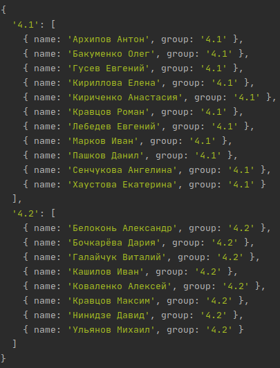

# mobile-development-lab2
## Складнощі, що виникли під час виконання завдання

Складнощі виникли через великі витрати оперативної пам'яті на середовище розробки (WebStorm)
та віртуальну машину, на якій відбувалась перевірка роботи додатку. Також при виконанні першої 
частини виникла необхідність реалізувати поставлені завдання засобами мови TypeScript, а не 
Swift.

## Скріншоти виконання

